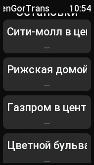
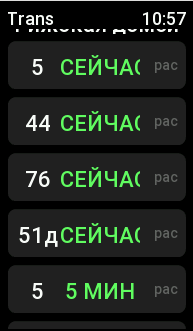

# ТюменьГорТранс

Приложение для отображения расписания общественного транспорта Тюмени на устройствах Zepp OS(изначально создавалось для Xiaomi smart band 7)

## Возможности

- Отображение списка остановок из конфига
- Получение предсказаний прибытия транспорта в реальном времени
- Три режима работы: remote, local, mock

## Требования

- Node.js 18+
- Zepp OS CLI (`npm install -g @zeppos/zeus-cli`)

## Установка зависимостей

```bash
npm install
```

## Сборка

```bash
zeus preview
```

Команда собирает приложение и генерирует QR-код для установки через приложение Zepp.

## Настройка

### config.js

```javascript
export const STOPS = {
    "Сити-молл в центр" : 1017,
    "Рижская домой": 138,
    "Газпром в центр": 134,
    "Цветной бульвар" : 321,
    "ЖДВ": 326,
    "Ершова": 225
};

export const API_MODE = 'remote';
// 'remote' - реальное API через телефон (BLE)
// 'local'  - локальное расписание из localAPI.js
// 'mock'   - случайные данные для тестирования
```

### API_MODE

| Режим | Описание | Требования |
|-------|---------|-----------|
| `remote` | Реальное API через app-side | Телефон с BLE |
| `local` | Локальное расписание | Файл `localAPI.js` |
| `mock` | Случайные данные | Ничего |

### Как узнать ID остановки

1. Откройте веб-версию api.tgt72.ru
2. Перейдите на нужную остановку
3. ID остановки в URL (например, `checkpoint_id=1017`)

### STOPS

Формат: `"Отображаемое имя" : ID остановки в API`

## Локальное расписание

Для режима `local` нужно сгенерировать файл `localAPI.js`:

```bash
node genLocal.js
```

Это создаст файл с расписанием для всех остановок из `STOPS`.

**Внимание:** Локальное расписание работает БЕЗ подключения к телефону!

## Архитектура

### Device Side (браслет)

- `app.js` - инициализация, API abstraction (выбирает режим)
- `page/StopsListPage.js` - список остановок
- `page/StopDetailPage.js` - детали остановки с прибытиями
- `shared/compressor.js` - распаковка данных (pako inflate + base64)

### App Side (телефон, только remote)

- `app-side/index.js` - обработка запросов от device
- Запрос предсказаний: `https://api.tgt72.ru/api/v5/prediction/?checkpoint_id=XXX`
- Запрос номера маршрута: `https://api.tgt72.ru/api/v5/routesforsearch/{route_id}/`
- Сжатие данных pako.deflate → base64

### Схема работы

```
┌─────────────────────┐     BLE (<2KB)     ┌─────────────────────┐
│    Device Side      │ ◄─────────────────► │     App Side        │
│   (Zepp OS app)    │                     │  (remote mode)      │
│                     │                     │                     │
│ • StopsListPage     │    compressed       │ • Получение данных   │
│ • StopDetailPage    │ ─────────────────►  │ • Сжатие pako       │
│ • API абстракция   │                     └─────────────────────┘
└─────────────────────┘

┌─────────────────────┐
│    Device Side      │
│   (local/mock)      │
│                     │
│ • StopsListPage     │──► LocalApi / MockApi
│ • StopDetailPage    │    (без BLE)
│ • API абстракция   │
└─────────────────────┘
```

## Формат данных

Внутренний формат для рендеринга:

```javascript
{
  arrivals: [
    {
      r: "20",           // номер маршрута
      t: 1774174907000,   // timestamp (мс)
      p: 1               // 1 = точное, 0 = плановое
    }
  ]
}
```

## Структура файлов

```
tgt/
├── app.js              # Device: API abstraction
├── app.json            # Конфигурация приложения
├── config.js           # Настройка остановок и режима
├── localAPI.js         # Локальное расписание (сгенерированный)
├── genLocal.js         # Генератор localAPI.js
├── page/
│   ├── StopsListPage.js    # Список остановок
│   └── StopDetailPage.js   # Детали остановки
├── app-side/
│   └── index.js        # App-side (remote mode)
└── shared/
    ├── compressor.js    # Сжатие/распаковка
    ├── message.js       # Коммуникация BLE
    └── pako.js         # Библиотека сжатия
```

## Картинки


